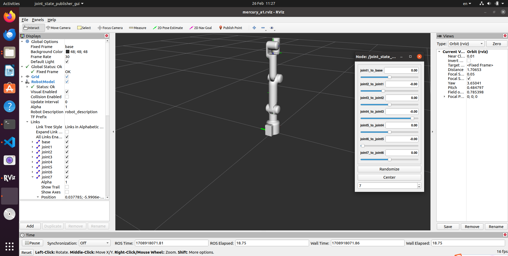

# mercury_ros
<!-- ALL-CONTRIBUTORS-BADGE:START - Do not remove or modify this section -->
[](#contributors-)
<!-- ALL-CONTRIBUTORS-BADGE:END -->

[](https://docs.elephantrobotics.com/docs/gitbook/12-ApplicationBaseROS/)
[](https://docs.elephantrobotics.com/docs/gitbook-en/12-ApplicationBaseROS/)

[中文文档](https://docs.elephantrobotics.com/docs/gitbook/12-ApplicationBaseROS/) | [English Documentation](https://docs.elephantrobotics.com/docs/gitbook-en/12-ApplicationBaseROS/)

Control or simulate Mercury series robots in ROS.



**Notes**:

* Supported ROS versions:
   * Ubuntu 20.04 / ROS Noetic

<!-- **If your `Atom` is 2.3 or before, or `pymycobot` is 1.\*, Please check branch [before](https://github.com/elephantrobotics/myCobotRos/tree/before)** -->

## Installation

### Local
#### 1 Pre-Requriements

For using this package, the [Python api](https://github.com/elephantrobotics/pymycobot.git) library should be installed first.

```bash
pip install pymycobot --user
```

Before installing the package, you need to create a ros workspace.

```bash
mkdir -p ~/catkin_ws/src  # Create folder
cd ~/catkin_ws/src        # Enter the folder
catkin_init_workspace     # Initialize the current directory into a ROS workspace
cd ..                     # Return to the upper directory
catkin_make               # Build the code in the workspace.
```

Add a workspace environment

```bash
$ echo "source ~/catkin_ws/devel/setup.bash" >> ~/.bashrc
$ source ~/.bashrc
```

#### 2 Package Download and Install

Install ros package in your src folder of your Catkin workspace.

```bash
$ cd ~/catkin_ws/src
$ git clone --depth 1 https://github.com/elephantrobotics/mercury_ros.git
$ cd ~/catkin_ws
$ catkin_make
$ source devel/setup.bash
```

## Run

Here we take Mercury A1 as an example

### 1 test

```bash
roslaunch merury_a1 test.launch
```

### 2 slider control

```bash
roslaunch mercury_a1 slider_control.launch
```

```bash
rosrun mercury_a1 slider_control.py
```

### 3 model follow

```bash
rosrun mercury_a1 follow_display.py
```

```bash
roslaunch mercury_a1 mercury_follow.launch
```

### 4 GUI control

```bash
roslaunch mercury_a1 simple_gui.launch
```

### 5 keyboard control

```bash
roslaunch mercury_a1 teleop_keyboard.launch
```

```bash
rosrun mercury_a1 teleop_keyboard.py
```

### 5 Moveit control

```bash
roslaunch mercury_a1_moveit mercury_a1.launch
```

```bash
rosrun mercury_a1_moveit sync_plan.py
```

## Where to get help

There is documentation in the [ElephantRobotics Docs](https://docs.elephantrobotics.com/docs/gitbook-en/). Please check the ROS chapter.

## Important Links & Docs

* [User Guide](https://docs.elephantrobotics.com/docs/gitbook-en/12-ApplicationBaseROS/)

